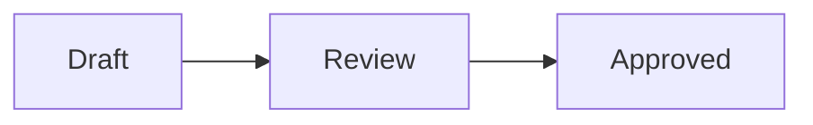

# Local Markdown Vault

Secure, local-only Markdown editing for Visual Studio Code, with an Obsidian-style Live Preview and a workspace Document Vault.

> **Project status:** usable macOS developer preview in active pre-release development. Install from source or a locally built VSIX. Windows and Linux qualification is planned later, and the extension is not yet published to the Visual Studio Marketplace.

Local Markdown Vault keeps notes and attachments as ordinary files in one local VS Code workspace. It does not provide cloud sync, accounts, telemetry, publishing, or background uploads.

## What it provides

### Live Preview editor

- CodeMirror-based Markdown editing with formatting rendered in place
- Source reveal around the cursor and normal text selection behavior
- Syntax highlighting, document outline, search, and editable tables
- Local images and attachments, Mermaid diagrams, draw.io diagrams, and themes
- Obsidian-style wikilinks, aliases, heading and block links, and inline embeds
- YAML properties, highlighted text, color-coded callouts, math, footnotes, tags, and interactive task lists
- Smart list editing that continues ordered numbers and unchecked tasks on Return
- Solid, hollow, and square markers that distinguish nested bullet levels

### Document Vault

- Native VS Code tree named after the actual Finder folder for notes, folders, and attachments
- Create, rename, move, delete/trash, drag-and-drop, sort, refresh, and reveal
- Immediate external-file updates with a coalesced reconciliation pass for folder renames and bulk changes
- Automatic Markdown and wikilink updates after file or folder moves
- Local vault search, Quick Switcher, backlinks, unlinked mentions, recent notes, tags, aliases, and hover previews
- Incremental metadata index that can be rebuilt from the files in the workspace

### Local-first security

- Remote images are blocked by default
- Raw HTML is rendered as inert text
- Dangerous protocols and paths outside the vault are rejected
- Filesystem paths are canonicalized and checked after symlink resolution
- Webview messages, pasted images, YAML, diagrams, SVG, XML, and queued work are bounded and validated
- Mermaid uses strict security mode; generated SVG is sanitized before insertion
- Restricted Workspace Trust mode disables diagrams, custom CSS, remote media, and vault-wide mutations
- No extension-managed network requests unless the user explicitly enables HTTPS remote images for the current workspace

See [SECURITY.md](SECURITY.md) for the security policy and threat-model summary.

## Scope

Local Markdown Vault deliberately does not include:

- Cloud or peer-to-peer synchronization
- User accounts, telemetry, analytics, or advertising
- Publishing or hosted note sharing
- Community plugins
- Obsidian Canvas or Bases
- A complete clone of the Obsidian desktop application

The first supported vault model is exactly one local `file:` workspace folder. Multi-root workspaces, arbitrary folders outside the workspace, nested vaults, and remote filesystem providers are deferred.

## Requirements

- Visual Studio Code 1.90 or newer
- macOS for the initially supported developer preview
- A local folder opened as a VS Code workspace
- Node.js 24 LTS and npm to build from source
- Git to clone the repository

## Install from source

### Install the prebuilt macOS test package

Download [local-markdown-vault-0.2.0.vsix](https://github.com/ArronJablonowski/local-markdown-vault-vscode/raw/refs/heads/main/releases/local-markdown-vault-0.2.0.vsix). You can install it entirely inside VS Code without administrator privileges or the `code` terminal command:

1. Open VS Code.
2. Open the **Extensions** panel by selecting its activity-bar icon or pressing `Shift+Cmd+X` on macOS.
3. Select the **...** menu at the top of the Extensions panel.
4. Select **Install from VSIX...**.
5. Choose the downloaded `local-markdown-vault-0.2.0.vsix` file.
6. Select **Reload Now** if VS Code prompts you to reload.

If the **...** menu is unavailable, press `Shift+Cmd+P` to open the Command Palette, run **Extensions: Install from VSIX...**, and select the same file. The expected SHA-256 checksum is recorded in [`releases/SHA256SUMS`](releases/SHA256SUMS).

The package is a macOS developer preview. Test it with a disposable vault before using important documents.

### 1. Clone and install dependencies

Using SSH:

```bash
git clone git@github.com:ArronJablonowski/local-markdown-vault-vscode.git
cd local-markdown-vault-vscode
npm run security:dependencies
npm ci --ignore-scripts
```

Or using HTTPS:

```bash
git clone https://github.com/ArronJablonowski/local-markdown-vault-vscode.git
cd local-markdown-vault-vscode
npm run security:dependencies
npm ci --ignore-scripts
```

The policy check verifies the lockfile source, integrity, production licenses,
and reviewed install-script set. `npm ci --ignore-scripts` then installs the
exact locked dependencies without executing package lifecycle scripts.

### 2. Run in a Development Extension Host

```bash
npm run compile
code .
```

In VS Code, press `F5` and choose **VS Code Extension Development** if prompted. In the new Extension Development Host window, open a local folder, then open a Markdown file.

To select the editor manually, run **View: Reopen Editor With...** and choose **Markdown Live Preview**.

### 3. Build and install a VSIX

```bash
npm run package
code --install-extension local-markdown-vault-0.2.0.vsix --force
```

You can also open the Extensions view, choose **... > Install from VSIX...**, and select the generated file. Reload VS Code after installation.

To remove a source-installed build:

```bash
code --uninstall-extension arronjablonowski.local-markdown-vault
```

## Using the extension

1. Open VS Code. If no folder is already open, the extension creates and opens `~/Documents/Markdown Vault` as the default vault. If you open another local folder, that folder remains the vault boundary and is never replaced.
2. Open a `.md` file with **Markdown Live Preview**.
3. Open the **Local Markdown Vault** activity-bar view to manage files and use knowledge-navigation tools.
4. Use `[[Note]]`, `[[Note|Alias]]`, `[[Note#Heading]]`, or `![[Attachment.png]]` for vault links and embeds.
5. Review workspace trust and security settings before enabling diagrams, custom CSS, or remote media in an unfamiliar workspace.

### Advanced Markdown how-to

These examples remain ordinary Markdown files and are compatible with the supported Obsidian-style syntax. In Live Preview, move the cursor away from a formatted line to see its rendered appearance; move the cursor back to reveal and edit its source.

#### Highlight text

Wrap text in double equals signs:

```markdown
This decision is ==important and time-sensitive==.
```

#### Create tasks and nested lists

Use `[ ]` for an open task and any non-space status character for a completed task. Press Return at the end of a task to create the next unchecked task. Press Tab and Shift+Tab to change list depth.

```markdown
- [ ] Review the draft
- [x] Approved
- [?] Needs clarification
  - [ ] Follow up with the author
```

Nested bullet levels automatically use solid, hollow, and square markers in Live Preview while keeping ordinary `-` markers in the file.

#### Add callouts

Start a blockquote with `[!type]`. Add `-` to start collapsed or `+` to start expanded.

```markdown
> [!note] Local note
> This information stays in the vault.

> [!warning]- Security reminder
> Expand this callout before enabling remote media.

> [!tip]+ Writing tip
> Callouts can contain **formatting**, [[wikilinks]], and lists.
```

Supported standard families include `note`, `abstract`, `info`, `todo`, `tip`, `success`, `question`, `warning`, `failure`, `danger`, `bug`, `example`, and `quote`. Common Obsidian aliases such as `faq`, `important`, `caution`, and `cite` are also recognized.

#### Add YAML properties

Place a YAML block at the very beginning of the note:

```yaml
---
title: Project plan
aliases:
  - Plan
  - Roadmap
tags:
  - project/active
priority: 3
approved: false
due: 2026-10-15
related: "[[Meeting Notes]]"
---
```

Live Preview provides typed controls for supported text, list, number, Boolean, date, date-time, tag, and quoted-wikilink values. Complex nested YAML remains editable source text.

#### Link to notes, headings, and blocks

```markdown
[[Project Plan]]
[[Project Plan|Open the plan]]
[[Project Plan#Milestones]]
[[Project Plan#^approval-record]]

This paragraph can be linked directly. ^approval-record
```

Typing `[[` opens local note completion. An unresolved wikilink can be used to create a new note inside the vault.

#### Embed local content

Add `!` before a wikilink to embed local content:

```markdown
![[Project Plan]]
![[Project Plan#Milestones]]
![[Project Plan#^approval-record]]
![[attachments/diagram.png|640x360]]
```

Note embeds are read-only inside the parent note. Edit the original note to change embedded content. Local files must remain inside the vault; remote images are blocked unless HTTPS media is explicitly enabled for the workspace.

#### Create a table

Use colons in the separator row to control alignment:

```markdown
| Item | Status | Cost |
| :--- | :----: | ---: |
| Draft | Complete | $0 |
| Review | Pending | $25 |
```

Select a rendered table cell to edit it or use the table controls to insert, move, sort, align, or delete rows and columns.

#### Add math and footnotes

```markdown
Inline math uses $E = mc^2$ within a sentence.

$$
f(x) = x^2 + 2x + 1
$$

This statement has a source.[^source]

[^source]: A local footnote definition.
```

#### Add tags and aliases

```markdown
#project/active #review
```

Tags may also be listed in YAML properties. Aliases defined in the `aliases` property are available to wikilink completion and the Quick Switcher.

#### Create a Mermaid diagram

````markdown

````

Mermaid runs locally in strict mode. Script execution, click callbacks, external resources, HTML labels, and document attempts to weaken strict mode remain blocked.

For a complete comparison corpus, see [`test/fixtures/obsidian-advanced`](test/fixtures/obsidian-advanced) and the [Obsidian compatibility guide](docs/OBSIDIAN_COMPATIBILITY.md).

Common shortcuts:

| Action | macOS | Windows/Linux |
| --- | --- | --- |
| Quick Switcher | `Cmd+O` | `Ctrl+O` |
| Vault search | `Cmd+Shift+F` | `Ctrl+Shift+F` |
| Save | `Cmd+S` | `Ctrl+S` |
| Command Palette | `Cmd+Shift+P` | `Ctrl+Shift+P` |

## Important settings

Search for `Local Markdown Vault` or `mdLivePreview` in VS Code Settings.

Edits made in Markdown Live Preview are saved automatically after a short
delay. This is enabled by default with `mdLivePreview.autoSave`. Autosave only
writes the already-open Markdown document when its resolved path remains
inside the current local workspace vault; it does not save attachments,
follow links, or write to paths supplied by Markdown content. Turn the setting
off if you prefer to save manually.

| Setting | Purpose | Default posture |
| --- | --- | --- |
| Default editor | Choose VS Code default, Markdown Live Preview, or Markdown Editor | VS Code default |
| Default Live Preview mode | Start each preview in Editing or Locked mode | Editing |
| Automatic save | Save coalesced Live Preview edits to the open vault note | Enabled |
| Remote media | Permit HTTPS images for this workspace | Blocked |
| Automatic link updates | Rewrite affected links after rename or move | Enabled |
| Attachment location | Choose where pasted attachments are stored | Inside vault |
| Open default vault on startup | Create and open `~/Documents/Markdown Vault` when no folder is open | Enabled |
| Vault sort order | Configure Document Vault ordering | Name |
| Reveal active file | Follow the active note in the vault tree | Enabled |
| Excluded paths | Omit paths from indexing and navigation | Conservative defaults |
| Diagram rendering | Enable Mermaid and draw.io rendering | Trust-aware |

The internal setting and command prefix remains `mdLivePreview` for compatibility with existing installations and keybindings.

## Development

```bash
npm run security:dependencies # verify lockfile and dependency policy
npm ci --ignore-scripts       # install without package lifecycle scripts
npm run compile        # build the extension and webviews
npm test               # unit tests
npm run test:e2e       # browser end-to-end tests
npm run test:integration
npm run test:integration:cache-restart
npm run test:integration:focused:macos # requires a foreground macOS desktop
npm run package        # verify and create the VSIX
```

Useful release and security checks are documented in [docs/RELEASE_CHECKLIST.md](docs/RELEASE_CHECKLIST.md). The full engineering roadmap and acceptance criteria are in [docs/PRODUCT_REQUIREMENTS.md](docs/PRODUCT_REQUIREMENTS.md).

Additional references:

- [Contributing and development workflow](CONTRIBUTING.md)
- [Obsidian compatibility](docs/OBSIDIAN_COMPATIBILITY.md)
- [Migration and rollback](docs/MIGRATION.md)
- [Accessibility](docs/ACCESSIBILITY.md)
- [Latest active security assessment](docs/SECURITY_ASSESSMENT_2026-09-21.md)
- [Security policy](SECURITY.md)

## Known limitations

- macOS is the only initially supported preview platform. Windows and Linux run in the automated portability matrix but remain unsupported until their manual filesystem, Trash, accessibility, and packaged-extension reviews are completed later in the development lifecycle.
- Only one local workspace folder is supported as a vault.
- Case-only rename transactions pass the automated Windows, macOS, and Linux matrix. Native macOS Trash movement, native text/vault transaction undo/redo, and real Live Preview keyboard undo/redo are automated on macOS; assistive-technology verification and Windows/Linux Trash behavior still require manual platform sign-off.
- VoiceOver, NVDA, and Orca checks remain part of the manual pre-release matrix.
- Large-vault performance depends on storage, exclusions, note size, and available system resources.
- The extension is under active security hardening and is not yet declared production-ready for hostile files.

## Reporting bugs and security issues

- General bugs and feature requests: [GitHub Issues](https://github.com/ArronJablonowski/local-markdown-vault-vscode/issues)
- Security vulnerabilities: follow the private-reporting guidance in [SECURITY.md](SECURITY.md)

Please include the VS Code version, operating system, extension version, workspace trust state, and minimal reproduction steps. Do not attach private vault contents.

## Project history and license

This project began as a fork of [t-shoot/md-live-preview-editor](https://github.com/t-shoot/md-live-preview-editor). Local Markdown Vault retains compatible Markdown files and credits the upstream project and bundled dependencies in [THIRD-PARTY-NOTICES.md](THIRD-PARTY-NOTICES.md).

Licensed under the [MIT License](LICENSE). Obsidian is a product of Dynalist Inc.; this independent project is not affiliated with or endorsed by Obsidian.
