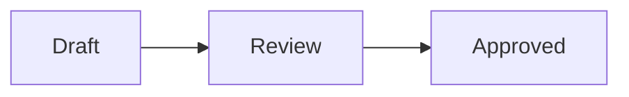

# Local Markdown Vault

Secure, local-only Markdown editing for Visual Studio Code, with an Obsidian-style Live Preview and a workspace Document Vault.

> **Project status:** cross-platform desktop release candidate in active pre-release development. The same VSIX supports macOS, Windows, and Linux. It is ready for platform testing but is not yet published to the Visual Studio Marketplace.

See the [functionality review](docs/FUNCTIONALITY_REVIEW_2026-09-22.md) for the
request-by-request implementation status, verified fixes, and remaining gaps.

Local Markdown Vault keeps notes and attachments as ordinary files in one local VS Code workspace. It does not provide cloud sync, accounts, telemetry, publishing, or background uploads.

## What it provides

### Live Preview editor

These rendering and interaction features belong to **Markdown Live Preview**,
the default viewing mode. **Markdown Editor** is VS Code's separate built-in editor: our CSS
themes, lock default, code-block controls, and editing fixes do not customize
that editor. Select **Markdown Live Preview** in **CSS Themes > Settings >
Default viewing mode** to use the extension's Obsidian-style implementation.
Existing explicitly saved viewing preferences are preserved when updating.

- CodeMirror-based Markdown editing with formatting rendered in place
- Source reveal around the cursor and normal text selection behavior
- Syntax highlighting, document outline, search, and editable tables with sticky headers
- Local images and attachments, Mermaid diagrams, draw.io diagrams, and themes
- Obsidian-style wikilinks, aliases, heading and block links, and inline embeds
- YAML properties, highlighted text, color-coded callouts, math, footnotes, tags, and interactive task lists
- Smart list editing that continues ordered numbers and unchecked tasks on Return
- Obsidian-style Shift+Return soft lines that stay inside the current list item
- Repeated Return reliably exits nested lists, tasks, quotes, and callouts—even at the bottom of a note
- Solid, hollow, and square markers that distinguish nested bullet levels

### Document Vault

- Native VS Code tree named after the actual workspace folder shown by Finder, File Explorer, or the Linux file manager
- Create, rename, move, delete/trash, drag-and-drop, sort, refresh, and reveal
- Right-click any vault file or folder and choose **Copy Absolute Path** to copy its full operating-system path, or **Copy Vault-Relative Path** for a path relative to the vault
- Immediate external-file updates with a coalesced reconciliation pass for folder renames and bulk changes
- Automatic Markdown and wikilink updates after file or folder moves
- Local vault search, Quick Switcher, backlinks, unlinked mentions, recent notes, tags, aliases, and hover previews
- Incremental metadata index that can be rebuilt from the files in the workspace

### Local-first security

The rendering protections below apply to **Markdown Live Preview**. Built-in
Markdown Editor and Markdown Preview use VS Code's own rendering and security
policies; the extension cannot guarantee its remote-image or inert-HTML policy
in those views. Vault filesystem protections apply to extension vault actions.

- Remote images are blocked by default
- Raw HTML is rendered as inert text, except bare `<br>` line breaks in table cells
- Dangerous protocols and paths outside the vault are rejected
- Filesystem paths are canonicalized and checked after symlink resolution
- Webview messages, pasted images, YAML, diagrams, SVG, XML, and queued work are bounded and validated
- Mermaid uses strict security mode; generated SVG is sanitized before insertion
- Restricted Workspace Trust mode disables diagrams, custom CSS, remote media, and vault-wide mutations
- No extension-managed network requests unless the user explicitly enables HTTPS remote images for the current workspace

See [SECURITY.md](SECURITY.md) for the security policy and threat-model summary.

## Scope

Local Markdown Vault deliberately does not include:

- Cloud or peer-to-peer synchronization
- User accounts, telemetry, analytics, or advertising
- Publishing or hosted note sharing
- Community plugins
- Obsidian Canvas or Bases
- A complete clone of the Obsidian desktop application

The first supported vault model is exactly one local `file:` workspace folder. Multi-root workspaces, arbitrary folders outside the workspace, nested vaults, and remote filesystem providers are deferred.

## Requirements

- Visual Studio Code 1.90 or newer
- macOS, Windows, or desktop Linux
- A local folder opened as a VS Code workspace
- Node.js 24 LTS and npm to build from source
- Git to clone the repository

## Install from source

### Install the prebuilt desktop test package

Download [local-markdown-vault-0.2.0.vsix](https://github.com/ArronJablonowski/local-markdown-vault-vscode/raw/refs/heads/main/releases/local-markdown-vault-0.2.0.vsix). You can install it entirely inside VS Code without administrator privileges or the `code` terminal command:

1. Open VS Code.
2. Open the **Extensions** panel by selecting its activity-bar icon. The shortcut is `Shift+Cmd+X` on macOS and `Ctrl+Shift+X` on Windows/Linux.
3. Select the **...** menu at the top of the Extensions panel.
4. Select **Install from VSIX...**.
5. Choose the downloaded `local-markdown-vault-0.2.0.vsix` file.
6. Select **Reload Now** if VS Code prompts you to reload.

If the **...** menu is unavailable, open the Command Palette with `Shift+Cmd+P` on macOS or `Ctrl+Shift+P` on Windows/Linux, run **Extensions: Install from VSIX...**, and select the same file. The expected SHA-256 checksum is recorded in [`releases/SHA256SUMS`](releases/SHA256SUMS).

The package is a cross-platform release candidate. Test it with a disposable vault before using important documents.

### 1. Clone and install dependencies

Using SSH:

```bash
git clone git@github.com:ArronJablonowski/local-markdown-vault-vscode.git
cd local-markdown-vault-vscode
npm run security:dependencies
npm ci --ignore-scripts
```

Or using HTTPS:

```bash
git clone https://github.com/ArronJablonowski/local-markdown-vault-vscode.git
cd local-markdown-vault-vscode
npm run security:dependencies
npm ci --ignore-scripts
```

The policy check verifies the lockfile source, integrity, production licenses,
and reviewed install-script set. `npm ci --ignore-scripts` then installs the
exact locked dependencies without executing package lifecycle scripts.

### 2. Run in a Development Extension Host

```bash
npm run compile
code .
```

In VS Code, press `F5` and choose **VS Code Extension Development** if prompted. In the new Extension Development Host window, open a local folder, then open a Markdown file.

To select the editor manually, run **View: Reopen Editor With...** and choose **Markdown Live Preview**.

### 3. Build and install a VSIX

```bash
npm run package
code --install-extension local-markdown-vault-0.2.0.vsix --force
```

You can also open the Extensions view, choose **... > Install from VSIX...**, and select the generated file. Reload VS Code after installation.

To remove a source-installed build:

```bash
code --uninstall-extension arronjablonowski.local-markdown-vault
```

## Using the extension

1. Open VS Code. If no folder is already open, the extension creates and opens `~/Documents/Markdown Vault` as the default vault. If you open another local folder, that folder remains the vault boundary and is never replaced.
2. Open a `.md` file with **Markdown Live Preview**.
3. Open the **Local Markdown Vault** activity-bar view to manage files and use knowledge-navigation tools.
4. Use `[[Note]]`, `[[Note|Alias]]`, `[[Note#Heading]]`, or `![[Attachment.png]]` for vault links and embeds.
5. Review workspace trust and security settings before enabling diagrams, custom CSS, or remote media in an unfamiliar workspace.

### Advanced Markdown how-to

Selecting **Text Editor** explicitly keeps that tab in source mode, even when
Markdown Editor is your default. Normal file opens and Document Vault opens
still use the configured default. Other extensions that explicitly request a
text editor are also respected rather than forcibly reopened in another mode.

**Built-in Markdown Editor limitation:** If Enter or Command/Ctrl+Enter leaves
the cursor inside the final nested list, switch to **Text Editor**, leave one
blank line after the list, and type the start of your next paragraph at column
1 (no indentation or bullet). Then switch back to **Markdown Editor**. Creating
blank lines alone may not resolve it. This workaround was tested in VS Code
1.138.0; the extension's Live Preview section-exit fixes do not change the
built-in editor.

These examples remain ordinary Markdown files and are compatible with the supported Obsidian-style syntax. In Live Preview, move the cursor away from a formatted line to see its rendered appearance; move the cursor back to reveal and edit its source.

#### Add emoji

Paste or type Unicode emoji anywhere in a note: 😄 ✅ ⚠️ 👩🏽‍💻.
They remain ordinary text in the saved Markdown, including in headings, tasks,
tables, and code. Appearance depends on the emoji fonts installed on your system.

In **Markdown Live Preview**, type `:smile`, `:heart`, `:warning`, or `:rocket`
and select a suggestion with the arrow keys and Enter, or click it. This small
offline menu inserts the actual emoji; it does not automatically rewrite existing
shortcodes. Code and link destinations do not offer emoji suggestions. Use your
system's character picker or paste for emoji not in the menu. No images, remote
fonts, or network service are used.

#### Highlight text

Wrap text in double equals signs:

```markdown
This decision is ==important and time-sensitive==.
```

At the end of highlighted text, press Return to start a normal line outside the
highlight. From anywhere inside highlighted text, press Command+Return on macOS
or Ctrl+Return on Windows and Linux to move the cursor after it.

#### Create tasks and nested lists

Use `[ ]` for an open task and any non-space status character for a completed task. Press Return at the end of a task to create the next unchecked task. Press Tab and Shift+Tab to change list depth.

```markdown
- [ ] Review the draft
- [x] Approved
- [?] Needs clarification
  - [ ] Follow up with the author
```

Nested bullet levels automatically use solid, hollow, and square markers in Live Preview while keeping ordinary `-` markers in the file.

Press **Tab** on a bullet to make it a sub-bullet, and **Shift+Tab** to move it
back one level. This also works on a new empty bullet after Return. Nested
lists stay compact beneath headings; intentional blank lines in your Markdown
are preserved. These behaviors apply to **Markdown Live Preview** while unlocked.

#### Add callouts

Start a blockquote with `[!type]`. Add `-` to start collapsed or `+` to start expanded.

```markdown
> [!note] Local note
> This information stays in the vault.

> [!abstract]
> A short summary of the key points.

> [!warning]- Security reminder
> Expand this callout before enabling remote media.

> [!tip]+ Writing tip
> Callouts can contain **formatting**, [[wikilinks]], and lists.
```

Supported standard families include `note`, `abstract`, `info`, `todo`, `tip`, `success`, `question`, `warning`, `failure`, `danger`, `bug`, `example`, and `quote`. Common Obsidian aliases such as `faq`, `important`, `caution`, and `cite` are also recognized.
`notes` is accepted as a convenience alias for `note`.

In Markdown Live Preview, Abstract uses a teal panel with a document icon;
Warning uses an amber panel with a warning-triangle icon. Both support title-only
callouts (just `> [!abstract]` or `> [!warning]`), custom titles, and body text.
To keep an entire section inside the tinted panel, prefix each of its lines
with `>`, including blank lines. A heading or paragraph outside the blockquote
is not part of the callout.

Callouts can also contain task lists, tables, fenced code, Mermaid/draw.io
diagrams, and display math. Keep the `>` prefix on every line of those objects.
Tab and Shift+Tab change bullet nesting inside the callout. Click the header
(or focus it and press Enter/Space) to fold the whole section without editing
the file. Folding survives unrelated edits during the current editor session;
the authored `+`/`-` marker controls its initial state when reopened.

See [callout QA coverage](docs/CALLOUT_QA_2026-09-23.md) for tested interactions
and remaining limitations.

#### Add YAML properties

Place a YAML block at the very beginning of the note:

```yaml
---
title: Project plan
aliases:
  - Plan
  - Roadmap
tags:
  - project/active
priority: 3
approved: false
due: 2026-10-15
related: "[[Meeting Notes]]"
---
```

Live Preview provides typed controls for supported text, list, number, Boolean, date, date-time, tag, and quoted-wikilink values. Complex nested YAML remains editable source text.

#### Link to notes, headings, and blocks

```markdown
[[Project Plan]]
[[Project Plan|Open the plan]]
[[Project Plan#Milestones]]
[[Project Plan#^approval-record]]

This paragraph can be linked directly. ^approval-record
```

Typing `[[` opens local note completion. An unresolved wikilink can be used to create a new note inside the vault.

#### Embed local content

Add `!` before a wikilink to embed local content:

```markdown
![[Project Plan]]
![[Project Plan#Milestones]]
![[Project Plan#^approval-record]]
![[attachments/diagram.png|640x360]]
```

Note embeds are read-only inside the parent note. Edit the original note to change embedded content. Local files must remain inside the vault; remote images are blocked unless HTTPS media is explicitly enabled for the workspace.

#### Create a table

Use colons in the separator row to control alignment:

```markdown
| Item | Status | Cost |
| :--- | :----: | ---: |
| Draft | Complete | $0 |
| Review | Pending | $25 |
```

Select a rendered table cell to edit it. Click the small **</>** button above
any table to show its Markdown source. This also works in Locked mode, where
the source remains read-only. Open **Table options** above the table
to insert, move, sort, align, or delete rows and columns. The menu starts closed
to keep notes uncluttered; actions that need a cell stay disabled until one is
selected. Use Tab or arrow keys within the controls, and Escape to close them.
The header row remains visible while a long table scrolls, then stops at the
bottom of that table. The pinned header follows horizontal scrolling, and you
can scroll sideways over either the header or the table body.
Wide tables scroll horizontally within the note instead
of squeezing their columns; use Shift+mouse wheel, a trackpad gesture, or focus
the table scroll region and use the horizontal scrollbar. To put multiple lines
inside one cell, use a bare `<br>` (or `<br/>`); tags with attributes and other
raw HTML remain inert text.

Drag across rendered text to highlight and copy it. Use **Select entire table**
in **Table options** to highlight the complete table; Copy places its Markdown
source on the clipboard, and Backspace or Delete removes the selected table.
Cut also copies and removes a selected table. In Edit mode, Cut, Backspace, and
Delete can remove mouse-selected plain text within rendered table cells without
affecting other rows or paragraphs. For a partial selection inside formatted
cell text (such as bold text or a link), click the cell to edit its Markdown
before cutting or deleting; ambiguous rendered selections are left unchanged.
Locked mode never removes table content.

In **Markdown Live Preview**, mouse selection and Command+C (macOS) or Ctrl+C
(Windows/Linux) work in both Edit and Locked modes. You can select part of a
table cell, drag across paragraphs and rendered blocks, or keep selecting while
scrolling. Selections spanning blocks copy the underlying Markdown; selections
inside a rendered table copy its displayed text. Locked mode permits copying
without modifying the document.

Clicking or attempting to type in a locked Live Preview briefly glimmers the
Lock/Edit switch as a reminder to unlock. The effect stops when unlocked and
is disabled for reduced-motion and forced-color accessibility settings.

To display spaces and return characters, open **CSS Themes → Settings → Show
spaces and line breaks (Live Preview)** and select **On**. The default is **Off**.
The same setting is available as `mdLivePreview.showWhitespace` in VS Code
Settings. It updates open Live Preview tabs immediately: spaces appear as dots,
tabs as arrows, and actual line breaks as `↵`. These are display-only markers on
editor text/source lines; they do not change files or copied text. Rendered
tables and diagrams remain uncluttered. This does not change VS Code's separate
built-in Markdown Editor or Text Editor settings.

#### Add math and footnotes

```markdown
Inline math uses $E = mc^2$ within a sentence.

$$
f(x) = x^2 + 2x + 1
$$

This statement has a source.[^source]

[^source]: A local footnote definition.
```

#### Add and leave a code block

Put the language after the opening three **backticks** (not hash marks), such as
` ```python ` or ` ```javascript `. The rendered block displays that language
in its header, including when collapsed. An unlabeled fence has no language
badge. The label is not included when you copy the code with its Copy button.

````markdown
```javascript
console.log('Stored locally');
```
````

After the last line of code, press Return once to create an empty code line and
press Return again to continue writing below the code block. You can also press
Down Arrow to move to the closing fence and then press Return. To leave the code
block immediately from any code line, press Command+Return on macOS or
Ctrl+Return on Windows and Linux.
For an unfinished top-level fenced block at the end of a note, these exit
actions add the matching closing fence before placing the caret on a normal
line. Existing code is preserved. Nested unfinished fences still need their
closing fence entered explicitly.

Every fenced code block, including a block containing only one line, has a
**Copy** button in Markdown Live Preview and Markdown Preview. The button copies
only the code, without the opening or closing fence.

Text and code can also be highlighted normally with the mouse. Backspace or
Delete removes the highlighted text; selecting every visible line of a fenced
code block removes its hidden opening and closing fences as well.

Code blocks containing eight or more lines also have a chevron control in
Markdown Live Preview and Markdown Preview. Select it, or focus it and press
Return or Space, to collapse or expand the block.

#### Add tags and aliases

```markdown
#project/active #review
```

Tags may also be listed in YAML properties. Aliases defined in the `aliases` property are available to wikilink completion and the Quick Switcher.

#### Create a Mermaid diagram

````markdown

````

Mermaid runs locally in strict mode. Script execution, click callbacks, external resources, HTML labels, and document attempts to weaken strict mode remain blocked.

Safe diagram colors and labels are preserved; SVG animations and external
resources remain disabled. Malformed diagrams show an error inside their panel.

For draw.io, use an uncompressed XML `drawio` fenced block or reference a local
file with ``. Multi-page diagrams have Previous/Next controls.
Referenced diagrams refresh after external file changes, including deletion and
recreation, without changing the Markdown note. Up to 256 distinct referenced
file paths are tracked per open editor; reopen the note if that limit is reached.
Compressed draw.io payloads still require exporting uncompressed XML first.

For a complete comparison corpus, see [`test/fixtures/obsidian-advanced`](test/fixtures/obsidian-advanced) and the [Obsidian compatibility guide](docs/OBSIDIAN_COMPATIBILITY.md).

For combined stress tests, copy [`test/fixtures/complex-qa`](test/fixtures/complex-qa)
into a disposable vault. Its four main notes combine properties, advanced inline
formatting, nested tasks/callouts, wide tables, math, links/embeds, Mermaid entity
tables, and multi-page draw.io diagrams. See the [complex Markdown QA report](docs/COMPLEX_MARKDOWN_QA_2026-09-23.md)
for coverage, fixes, and limitations. Diagram fences nested in lists or callouts
must start on their own line, with the appropriate indentation or `>` prefix.

### Use the Obsidian Dark theme

Local Markdown Vault includes an independently authored `obsidian-dark.css`
theme with an Obsidian-inspired dark palette, typography, headings, links,
tasks, highlights, callouts, tables, code blocks, and properties. Open the
**Local Markdown Vault** sidebar, expand **CSS Themes**, and select
`obsidian-dark.css`. Custom CSS is intentionally disabled in Restricted Mode;
trust the vault workspace before enabling a theme you have reviewed.

Common shortcuts:

| Action | macOS | Windows/Linux |
| --- | --- | --- |
| Quick Switcher | `Cmd+O` | `Ctrl+O` |
| Vault search | `Cmd+Shift+F` | `Ctrl+Shift+F` |
| Save | `Cmd+S` | `Ctrl+S` |
| Command Palette | `Cmd+Shift+P` | `Ctrl+Shift+P` |

## Important settings

Search for `Local Markdown Vault` or `mdLivePreview` in VS Code Settings.

Every change to an open Markdown document is saved automatically after a short
delay in every viewing mode. In Live Preview, this includes typed text, task
checkbox changes, properties, tables, and other controls that modify the
underlying Markdown. This is enabled by default with `mdLivePreview.autoSave`. Autosave only
writes the already-open Markdown document when its resolved path remains
inside the current local workspace vault; it does not save attachments,
follow links, or write to paths supplied by Markdown content. Turn the setting
off if you prefer to save manually.

| Setting | Purpose | Default posture |
| --- | --- | --- |
| Default viewing mode | **Markdown Editor** opens VS Code's built-in Markdown Editor; **VS Code Markdown Editor** is a compatible alias for that same view. **Markdown Live Preview** opens Local Markdown Vault's custom editor. Text Editor, Markdown Preview, and VS Code default are also available. | Markdown Live Preview |
| Vault file tabs | Reuse one preview tab while browsing, or keep every opened vault file in a separate tab | Reuse one preview tab |
| Default Live Preview mode | Start each preview in Editing or Locked mode | Editing |
| Automatic save | Save every coalesced change to an open vault Markdown file in any viewing mode | Enabled |
| Remote media | Permit HTTPS images for this workspace | Blocked |
| Automatic link updates | Rewrite affected links after rename or move | Enabled |
| Attachment location | Choose where pasted attachments are stored | Inside vault |
| Open default vault on startup | Create and open `~/Documents/Markdown Vault` when no folder is open | Enabled |
| Vault sort order | Configure Document Vault ordering | Name |
| Reveal active file | Follow the active note in the vault tree | Enabled |
| Excluded paths | Omit paths from indexing and navigation | Conservative defaults |
| Diagram rendering | Enable Mermaid and draw.io rendering | Trust-aware |

The internal setting and command prefix remains `mdLivePreview` for compatibility with existing installations and keybindings.

## Development

```bash
npm run security:dependencies # verify lockfile and dependency policy
npm ci --ignore-scripts       # install without package lifecycle scripts
npm run compile        # build the extension and webviews
npm test               # unit tests
npm run test:e2e       # browser end-to-end tests
npm run test:integration
npm run test:integration:cache-restart
npm run test:integration:focused # requires a desktop session; use xvfb-run on headless Linux
npm run package        # verify and create the VSIX
```

Useful release and security checks are documented in [docs/RELEASE_CHECKLIST.md](docs/RELEASE_CHECKLIST.md). The full engineering roadmap and acceptance criteria are in [docs/PRODUCT_REQUIREMENTS.md](docs/PRODUCT_REQUIREMENTS.md).

Additional references:

- [Contributing and development workflow](CONTRIBUTING.md)
- [Obsidian compatibility](docs/OBSIDIAN_COMPATIBILITY.md)
- [Migration and rollback](docs/MIGRATION.md)
- [Windows and Linux testing](docs/PLATFORM_TESTING.md)
- [Accessibility](docs/ACCESSIBILITY.md)
- [Latest active security assessment](docs/SECURITY_ASSESSMENT_2026-09-21.md)
- [Security policy](SECURITY.md)

## Known limitations

- Only one local workspace folder is supported as a vault.
- Windows, macOS, and Linux run the same source, package, filesystem, Trash, undo/redo, autosave, security, Restricted Mode, cache-recovery, and installed-VSIX validation gates. Platform-specific manual usability testing is still required before a production release.
- VoiceOver, NVDA, and Orca checks remain part of the manual pre-release matrix.
- Large-vault performance depends on storage, exclusions, note size, and available system resources.
- The extension is under active security hardening and is not yet declared production-ready for hostile files.

## Reporting bugs and security issues

- General bugs and feature requests: [GitHub Issues](https://github.com/ArronJablonowski/local-markdown-vault-vscode/issues)
- Security vulnerabilities: follow the private-reporting guidance in [SECURITY.md](SECURITY.md)

Please include the VS Code version, operating system, extension version, workspace trust state, and minimal reproduction steps. Do not attach private vault contents.

## Project history and license

This project began as a fork of [t-shoot/md-live-preview-editor](https://github.com/t-shoot/md-live-preview-editor). Local Markdown Vault retains compatible Markdown files and credits the upstream project and bundled dependencies in [THIRD-PARTY-NOTICES.md](THIRD-PARTY-NOTICES.md).

Licensed under the [MIT License](LICENSE). Obsidian is a product of Dynalist Inc.; this independent project is not affiliated with or endorsed by Obsidian.
