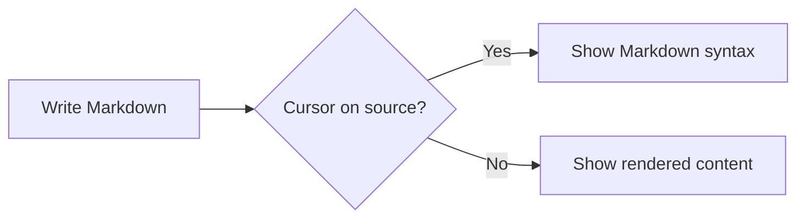

# Local Markdown Vault Sample

Edit this document directly in Live Preview. Lines away from the cursor remain rendered, while the active source is available for precise Markdown editing.

> Notes remain ordinary Markdown files. The extension does not convert them to a proprietary format.

## Core features

- Live Preview editing
- Syntax-highlighted fenced code
- Mermaid and draw.io diagrams
- Obsidian-style wikilinks and embeds
- Typed properties, callouts, math, footnotes, tags, tasks, and tables
- Local-only Document Vault navigation

### Setup checklist

- [x] Open a local folder as the vault
- [x] Create a Markdown note
- [ ] Test moving and renaming a disposable note

## Code example

```python
def open_preview(path):
    """Open a Markdown file in Live Preview."""
    print(f"Opened {path} in Live Preview")
```

## Mermaid example



## Table example

| Name | Notes | Status |
| --- | --- | --- |
| Alice | Ready | OK |
|  | Pending | Review |
| Bob | Complete |  |

## Callout and footnote

> [!NOTE] Local files
> Keep important notes backed up with a method you control.

This sentence includes a footnote.[^1]

[^1]: Footnotes remain ordinary Markdown.

## Links

- Internal note: [[Project Notes]]
- Aliased note: [[Project Notes|planning notes]]
- Standard Markdown link: [README](../README.md)
