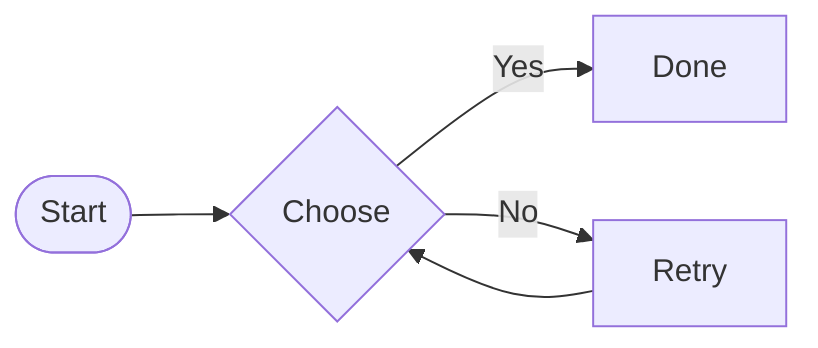
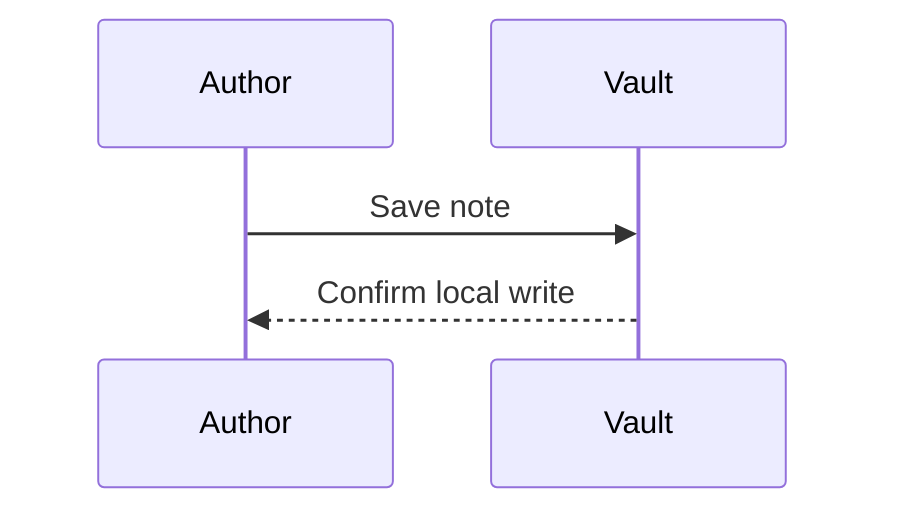
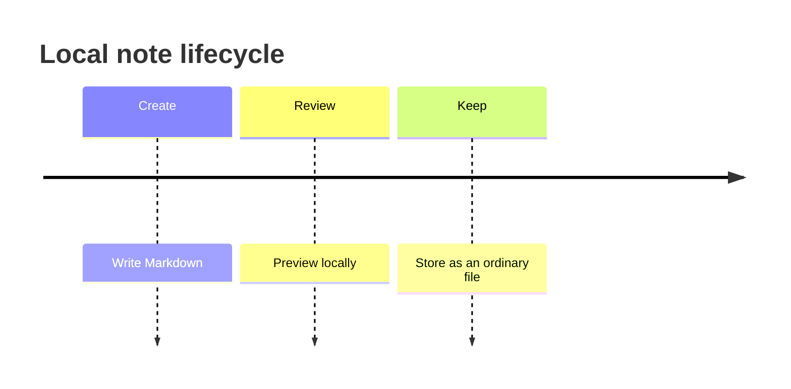
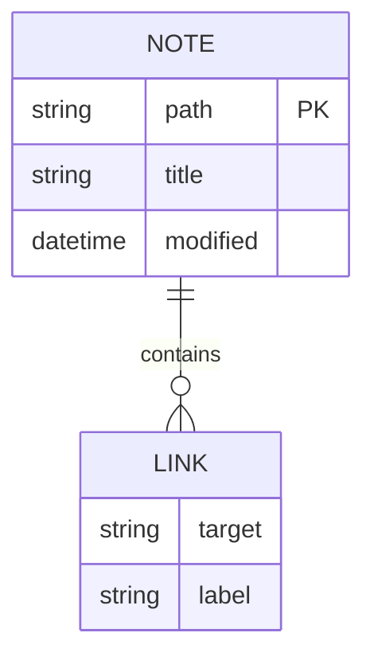

# Properties

The property editor should present text, lists, numbers, checkboxes, dates, date-times, tags, and quoted internal links without changing the underlying YAML format.

# Links and embeds

## Local attachments


Wikilinks: [[Targets/Linked Note]], [[Targets/Linked Note|Custom label]], and [[Property Fixture]].

Heading link: [[Targets/Linked Note#Detailed section|Jump to details]].

Block link: [[Targets/Linked Note#^linked-block|Jump to block]].

Same-note heading link: [[#Embedded note]].

Markdown internal link: [Linked note](Targets/Linked%20Note.md).

Unresolved link: [[A note that does not exist]].

## Embedded note

![[Targets/Embed Source]]

## Embedded heading

![[Targets/Embed Source#Selected heading]]

## Embedded block

![[Targets/Embed Source#^selected-block]]

## Embedded list

![[Targets/Embed Source#^selected-list]]

# Diagrams







```drawio
<mxfile><diagram name="Editing"><mxGraphModel><root><mxCell id="0"/><mxCell id="1" parent="0"/><mxCell id="2" value="Editor" vertex="1" parent="1" style="rounded=1;fillColor=#dae8fc;strokeColor=#6c8ebf;"><mxGeometry x="20" y="20" width="180" height="60" as="geometry"/></mxCell><mxCell id="3" value="Local vault" vertex="1" parent="1"><mxGeometry x="280" y="120" width="160" height="60" as="geometry"/></mxCell><mxCell id="4" value="Save" edge="1" source="2" target="3" parent="1"><mxGeometry relative="1" as="geometry"/></mxCell></root></mxGraphModel></diagram><diagram name="Reading"><mxGraphModel><root><mxCell id="0"/><mxCell id="1" parent="0"/><mxCell id="2" value="Preview" vertex="1" parent="1" style="rounded=1;fillColor=#dae8fc;strokeColor=#6c8ebf;"><mxGeometry x="20" y="20" width="180" height="60" as="geometry"/></mxCell><mxCell id="3" value="Local vault" vertex="1" parent="1"><mxGeometry x="280" y="120" width="160" height="60" as="geometry"/></mxCell><mxCell id="4" value="Save" edge="1" source="2" target="3" parent="1"><mxGeometry relative="1" as="geometry"/></mxCell></root></mxGraphModel></diagram></mxfile>
```

## Combined table

| Feature | Value | Detail |
| :--- | :---: | ---: |
| **Bold** and *italic* | `literal <br>` | 42 |
| Line breaks | First<br>Second | $75–$85 |
| Links | [Documentation](https://example.com) | café ✅ |

# Advanced formatting

Plain paragraph with **bold**, *italic*, ***bold italic***, ~~strikethrough~~, and ==highlighted text==.

Nested formatting: **bold with _nested italic_ and `inline code`**.

Escaped syntax stays literal: \*not italic\*, \#not-a-tag, and 1\. not a list.

Inline `code with **literal markers**` and ``code containing a ` backtick``.

> A blockquote with **formatted text**.
>
> A second paragraph in the same quote.

---

Visible text before an %%inline editing comment%% visible text after it.

%%
This block comment is visible only while editing.
It can span multiple lines.
%%

#project/advanced #Unicode/✅

> [!info] Nested diagram
>
> ```mermaid
> flowchart LR
>   A[Callout] --> B[Diagram]
> ```

- Diagram inside a list item

  ```mermaid
  flowchart LR
    A[List] --> B[Diagram]
  ```

Paragraph with a block identifier. ^formatting-block


