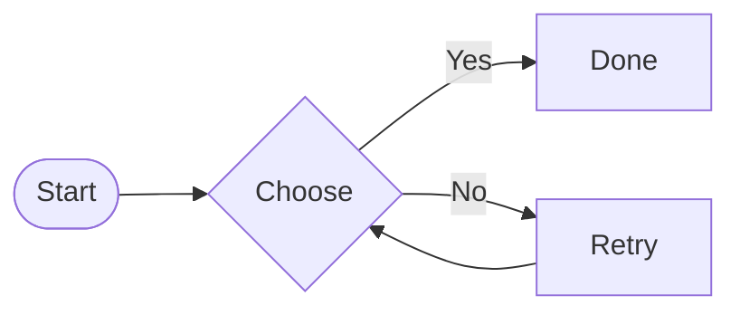
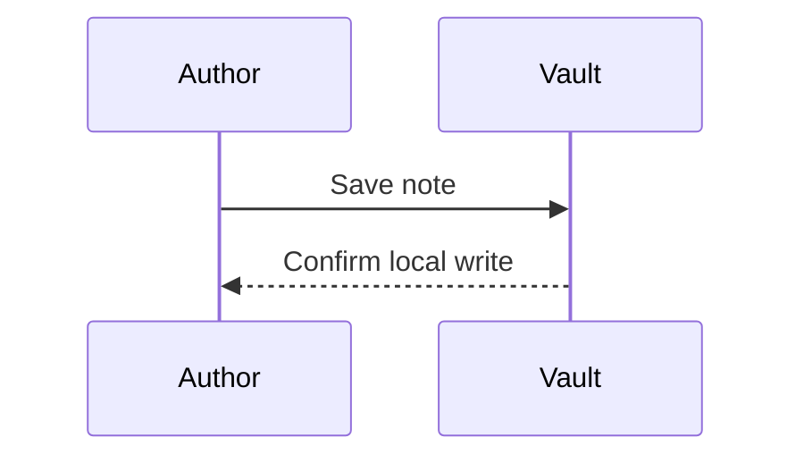
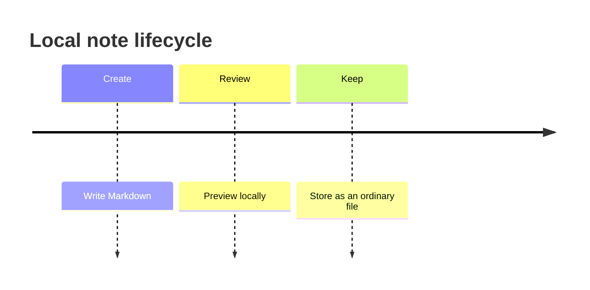

# Properties

The property editor should present text, lists, numbers, checkboxes, dates, date-times, tags, and quoted internal links without changing the underlying YAML format.

# Callouts

> [!note] Note title
> Standard note content with **formatting** and [[Targets/Linked Note|a link]].

> [!abstract] Abstract title
> Abstract content.

> [!info] Information title
> Information content.

> [!todo] Todo title
> Todo content.

> [!tip] Tip title
> Tip content.

> [!success] Success title
> Success content.

> [!question] Question title
> Question content.

> [!warning] Warning title
> Warning content.

> [!failure] Failure title
> Failure content.

> [!danger] Danger title
> Danger content.

> [!bug] Bug title
> Bug content.

> [!example] Example title
> Example content.

> [!quote] Quote title
> Quote content.

> [!faq]- Collapsed by default
> Hidden until expanded.

> [!tip]+ Expanded by default
> Visible until collapsed.

> [!question] Nested callouts
> Outer content.
>
> > [!todo] Nested todo
> > Nested content.

## Wide inventory

| Column 0 | Column 1 | Column 2 | Column 3 | Column 4 | Column 5 | Column 6 | Column 7 | Column 8 | Column 9 | Column 10 | Column 11 | Column 12 | Column 13 | Column 14 | Column 15 |
| --- | --- | --- | --- | --- | --- | --- | --- | --- | --- | --- | --- | --- | --- | --- | --- |
| **Item 0:0**<br>Local details | **Item 0:1**<br>Local details | **Item 0:2**<br>Local details | **Item 0:3**<br>Local details | **Item 0:4**<br>Local details | **Item 0:5**<br>Local details | **Item 0:6**<br>Local details | **Item 0:7**<br>Local details | **Item 0:8**<br>Local details | **Item 0:9**<br>Local details | **Item 0:10**<br>Local details | **Item 0:11**<br>Local details | **Item 0:12**<br>Local details | **Item 0:13**<br>Local details | **Item 0:14**<br>Local details | **Item 0:15**<br>Local details |
| Value 1:0 | Value 1:1 | Value 1:2 | Value 1:3 | Value 1:4 | Value 1:5 | Value 1:6 | Value 1:7 | Value 1:8 | Value 1:9 | Value 1:10 | Value 1:11 | Value 1:12 | Value 1:13 | Value 1:14 | Value 1:15 |
| Value 2:0 | Value 2:1 | Value 2:2 | Value 2:3 | Value 2:4 | Value 2:5 | Value 2:6 | Value 2:7 | Value 2:8 | Value 2:9 | Value 2:10 | Value 2:11 | Value 2:12 | Value 2:13 | Value 2:14 | Value 2:15 |
| **Item 3:0**<br>Local details | **Item 3:1**<br>Local details | **Item 3:2**<br>Local details | **Item 3:3**<br>Local details | **Item 3:4**<br>Local details | **Item 3:5**<br>Local details | **Item 3:6**<br>Local details | **Item 3:7**<br>Local details | **Item 3:8**<br>Local details | **Item 3:9**<br>Local details | **Item 3:10**<br>Local details | **Item 3:11**<br>Local details | **Item 3:12**<br>Local details | **Item 3:13**<br>Local details | **Item 3:14**<br>Local details | **Item 3:15**<br>Local details |
| Value 4:0 | Value 4:1 | Value 4:2 | Value 4:3 | Value 4:4 | Value 4:5 | Value 4:6 | Value 4:7 | Value 4:8 | Value 4:9 | Value 4:10 | Value 4:11 | Value 4:12 | Value 4:13 | Value 4:14 | Value 4:15 |
| Value 5:0 | Value 5:1 | Value 5:2 | Value 5:3 | Value 5:4 | Value 5:5 | Value 5:6 | Value 5:7 | Value 5:8 | Value 5:9 | Value 5:10 | Value 5:11 | Value 5:12 | Value 5:13 | Value 5:14 | Value 5:15 |
| **Item 6:0**<br>Local details | **Item 6:1**<br>Local details | **Item 6:2**<br>Local details | **Item 6:3**<br>Local details | **Item 6:4**<br>Local details | **Item 6:5**<br>Local details | **Item 6:6**<br>Local details | **Item 6:7**<br>Local details | **Item 6:8**<br>Local details | **Item 6:9**<br>Local details | **Item 6:10**<br>Local details | **Item 6:11**<br>Local details | **Item 6:12**<br>Local details | **Item 6:13**<br>Local details | **Item 6:14**<br>Local details | **Item 6:15**<br>Local details |
| Value 7:0 | Value 7:1 | Value 7:2 | Value 7:3 | Value 7:4 | Value 7:5 | Value 7:6 | Value 7:7 | Value 7:8 | Value 7:9 | Value 7:10 | Value 7:11 | Value 7:12 | Value 7:13 | Value 7:14 | Value 7:15 |
| Value 8:0 | Value 8:1 | Value 8:2 | Value 8:3 | Value 8:4 | Value 8:5 | Value 8:6 | Value 8:7 | Value 8:8 | Value 8:9 | Value 8:10 | Value 8:11 | Value 8:12 | Value 8:13 | Value 8:14 | Value 8:15 |
| **Item 9:0**<br>Local details | **Item 9:1**<br>Local details | **Item 9:2**<br>Local details | **Item 9:3**<br>Local details | **Item 9:4**<br>Local details | **Item 9:5**<br>Local details | **Item 9:6**<br>Local details | **Item 9:7**<br>Local details | **Item 9:8**<br>Local details | **Item 9:9**<br>Local details | **Item 9:10**<br>Local details | **Item 9:11**<br>Local details | **Item 9:12**<br>Local details | **Item 9:13**<br>Local details | **Item 9:14**<br>Local details | **Item 9:15**<br>Local details |
| Value 10:0 | Value 10:1 | Value 10:2 | Value 10:3 | Value 10:4 | Value 10:5 | Value 10:6 | Value 10:7 | Value 10:8 | Value 10:9 | Value 10:10 | Value 10:11 | Value 10:12 | Value 10:13 | Value 10:14 | Value 10:15 |
| Value 11:0 | Value 11:1 | Value 11:2 | Value 11:3 | Value 11:4 | Value 11:5 | Value 11:6 | Value 11:7 | Value 11:8 | Value 11:9 | Value 11:10 | Value 11:11 | Value 11:12 | Value 11:13 | Value 11:14 | Value 11:15 |
| **Item 12:0**<br>Local details | **Item 12:1**<br>Local details | **Item 12:2**<br>Local details | **Item 12:3**<br>Local details | **Item 12:4**<br>Local details | **Item 12:5**<br>Local details | **Item 12:6**<br>Local details | **Item 12:7**<br>Local details | **Item 12:8**<br>Local details | **Item 12:9**<br>Local details | **Item 12:10**<br>Local details | **Item 12:11**<br>Local details | **Item 12:12**<br>Local details | **Item 12:13**<br>Local details | **Item 12:14**<br>Local details | **Item 12:15**<br>Local details |
| Value 13:0 | Value 13:1 | Value 13:2 | Value 13:3 | Value 13:4 | Value 13:5 | Value 13:6 | Value 13:7 | Value 13:8 | Value 13:9 | Value 13:10 | Value 13:11 | Value 13:12 | Value 13:13 | Value 13:14 | Value 13:15 |
| Value 14:0 | Value 14:1 | Value 14:2 | Value 14:3 | Value 14:4 | Value 14:5 | Value 14:6 | Value 14:7 | Value 14:8 | Value 14:9 | Value 14:10 | Value 14:11 | Value 14:12 | Value 14:13 | Value 14:14 | Value 14:15 |
| **Item 15:0**<br>Local details | **Item 15:1**<br>Local details | **Item 15:2**<br>Local details | **Item 15:3**<br>Local details | **Item 15:4**<br>Local details | **Item 15:5**<br>Local details | **Item 15:6**<br>Local details | **Item 15:7**<br>Local details | **Item 15:8**<br>Local details | **Item 15:9**<br>Local details | **Item 15:10**<br>Local details | **Item 15:11**<br>Local details | **Item 15:12**<br>Local details | **Item 15:13**<br>Local details | **Item 15:14**<br>Local details | **Item 15:15**<br>Local details |
| Value 16:0 | Value 16:1 | Value 16:2 | Value 16:3 | Value 16:4 | Value 16:5 | Value 16:6 | Value 16:7 | Value 16:8 | Value 16:9 | Value 16:10 | Value 16:11 | Value 16:12 | Value 16:13 | Value 16:14 | Value 16:15 |
| Value 17:0 | Value 17:1 | Value 17:2 | Value 17:3 | Value 17:4 | Value 17:5 | Value 17:6 | Value 17:7 | Value 17:8 | Value 17:9 | Value 17:10 | Value 17:11 | Value 17:12 | Value 17:13 | Value 17:14 | Value 17:15 |
| **Item 18:0**<br>Local details | **Item 18:1**<br>Local details | **Item 18:2**<br>Local details | **Item 18:3**<br>Local details | **Item 18:4**<br>Local details | **Item 18:5**<br>Local details | **Item 18:6**<br>Local details | **Item 18:7**<br>Local details | **Item 18:8**<br>Local details | **Item 18:9**<br>Local details | **Item 18:10**<br>Local details | **Item 18:11**<br>Local details | **Item 18:12**<br>Local details | **Item 18:13**<br>Local details | **Item 18:14**<br>Local details | **Item 18:15**<br>Local details |
| Value 19:0 | Value 19:1 | Value 19:2 | Value 19:3 | Value 19:4 | Value 19:5 | Value 19:6 | Value 19:7 | Value 19:8 | Value 19:9 | Value 19:10 | Value 19:11 | Value 19:12 | Value 19:13 | Value 19:14 | Value 19:15 |
| Value 20:0 | Value 20:1 | Value 20:2 | Value 20:3 | Value 20:4 | Value 20:5 | Value 20:6 | Value 20:7 | Value 20:8 | Value 20:9 | Value 20:10 | Value 20:11 | Value 20:12 | Value 20:13 | Value 20:14 | Value 20:15 |
| **Item 21:0**<br>Local details | **Item 21:1**<br>Local details | **Item 21:2**<br>Local details | **Item 21:3**<br>Local details | **Item 21:4**<br>Local details | **Item 21:5**<br>Local details | **Item 21:6**<br>Local details | **Item 21:7**<br>Local details | **Item 21:8**<br>Local details | **Item 21:9**<br>Local details | **Item 21:10**<br>Local details | **Item 21:11**<br>Local details | **Item 21:12**<br>Local details | **Item 21:13**<br>Local details | **Item 21:14**<br>Local details | **Item 21:15**<br>Local details |
| Value 22:0 | Value 22:1 | Value 22:2 | Value 22:3 | Value 22:4 | Value 22:5 | Value 22:6 | Value 22:7 | Value 22:8 | Value 22:9 | Value 22:10 | Value 22:11 | Value 22:12 | Value 22:13 | Value 22:14 | Value 22:15 |
| Value 23:0 | Value 23:1 | Value 23:2 | Value 23:3 | Value 23:4 | Value 23:5 | Value 23:6 | Value 23:7 | Value 23:8 | Value 23:9 | Value 23:10 | Value 23:11 | Value 23:12 | Value 23:13 | Value 23:14 | Value 23:15 |
| **Item 24:0**<br>Local details | **Item 24:1**<br>Local details | **Item 24:2**<br>Local details | **Item 24:3**<br>Local details | **Item 24:4**<br>Local details | **Item 24:5**<br>Local details | **Item 24:6**<br>Local details | **Item 24:7**<br>Local details | **Item 24:8**<br>Local details | **Item 24:9**<br>Local details | **Item 24:10**<br>Local details | **Item 24:11**<br>Local details | **Item 24:12**<br>Local details | **Item 24:13**<br>Local details | **Item 24:14**<br>Local details | **Item 24:15**<br>Local details |
| Value 25:0 | Value 25:1 | Value 25:2 | Value 25:3 | Value 25:4 | Value 25:5 | Value 25:6 | Value 25:7 | Value 25:8 | Value 25:9 | Value 25:10 | Value 25:11 | Value 25:12 | Value 25:13 | Value 25:14 | Value 25:15 |
| Value 26:0 | Value 26:1 | Value 26:2 | Value 26:3 | Value 26:4 | Value 26:5 | Value 26:6 | Value 26:7 | Value 26:8 | Value 26:9 | Value 26:10 | Value 26:11 | Value 26:12 | Value 26:13 | Value 26:14 | Value 26:15 |
| **Item 27:0**<br>Local details | **Item 27:1**<br>Local details | **Item 27:2**<br>Local details | **Item 27:3**<br>Local details | **Item 27:4**<br>Local details | **Item 27:5**<br>Local details | **Item 27:6**<br>Local details | **Item 27:7**<br>Local details | **Item 27:8**<br>Local details | **Item 27:9**<br>Local details | **Item 27:10**<br>Local details | **Item 27:11**<br>Local details | **Item 27:12**<br>Local details | **Item 27:13**<br>Local details | **Item 27:14**<br>Local details | **Item 27:15**<br>Local details |
| Value 28:0 | Value 28:1 | Value 28:2 | Value 28:3 | Value 28:4 | Value 28:5 | Value 28:6 | Value 28:7 | Value 28:8 | Value 28:9 | Value 28:10 | Value 28:11 | Value 28:12 | Value 28:13 | Value 28:14 | Value 28:15 |
| Value 29:0 | Value 29:1 | Value 29:2 | Value 29:3 | Value 29:4 | Value 29:5 | Value 29:6 | Value 29:7 | Value 29:8 | Value 29:9 | Value 29:10 | Value 29:11 | Value 29:12 | Value 29:13 | Value 29:14 | Value 29:15 |
| **Item 30:0**<br>Local details | **Item 30:1**<br>Local details | **Item 30:2**<br>Local details | **Item 30:3**<br>Local details | **Item 30:4**<br>Local details | **Item 30:5**<br>Local details | **Item 30:6**<br>Local details | **Item 30:7**<br>Local details | **Item 30:8**<br>Local details | **Item 30:9**<br>Local details | **Item 30:10**<br>Local details | **Item 30:11**<br>Local details | **Item 30:12**<br>Local details | **Item 30:13**<br>Local details | **Item 30:14**<br>Local details | **Item 30:15**<br>Local details |
| Value 31:0 | Value 31:1 | Value 31:2 | Value 31:3 | Value 31:4 | Value 31:5 | Value 31:6 | Value 31:7 | Value 31:8 | Value 31:9 | Value 31:10 | Value 31:11 | Value 31:12 | Value 31:13 | Value 31:14 | Value 31:15 |
| Value 32:0 | Value 32:1 | Value 32:2 | Value 32:3 | Value 32:4 | Value 32:5 | Value 32:6 | Value 32:7 | Value 32:8 | Value 32:9 | Value 32:10 | Value 32:11 | Value 32:12 | Value 32:13 | Value 32:14 | Value 32:15 |
| **Item 33:0**<br>Local details | **Item 33:1**<br>Local details | **Item 33:2**<br>Local details | **Item 33:3**<br>Local details | **Item 33:4**<br>Local details | **Item 33:5**<br>Local details | **Item 33:6**<br>Local details | **Item 33:7**<br>Local details | **Item 33:8**<br>Local details | **Item 33:9**<br>Local details | **Item 33:10**<br>Local details | **Item 33:11**<br>Local details | **Item 33:12**<br>Local details | **Item 33:13**<br>Local details | **Item 33:14**<br>Local details | **Item 33:15**<br>Local details |
| Value 34:0 | Value 34:1 | Value 34:2 | Value 34:3 | Value 34:4 | Value 34:5 | Value 34:6 | Value 34:7 | Value 34:8 | Value 34:9 | Value 34:10 | Value 34:11 | Value 34:12 | Value 34:13 | Value 34:14 | Value 34:15 |
| Value 35:0 | Value 35:1 | Value 35:2 | Value 35:3 | Value 35:4 | Value 35:5 | Value 35:6 | Value 35:7 | Value 35:8 | Value 35:9 | Value 35:10 | Value 35:11 | Value 35:12 | Value 35:13 | Value 35:14 | Value 35:15 |
| **Item 36:0**<br>Local details | **Item 36:1**<br>Local details | **Item 36:2**<br>Local details | **Item 36:3**<br>Local details | **Item 36:4**<br>Local details | **Item 36:5**<br>Local details | **Item 36:6**<br>Local details | **Item 36:7**<br>Local details | **Item 36:8**<br>Local details | **Item 36:9**<br>Local details | **Item 36:10**<br>Local details | **Item 36:11**<br>Local details | **Item 36:12**<br>Local details | **Item 36:13**<br>Local details | **Item 36:14**<br>Local details | **Item 36:15**<br>Local details |
| Value 37:0 | Value 37:1 | Value 37:2 | Value 37:3 | Value 37:4 | Value 37:5 | Value 37:6 | Value 37:7 | Value 37:8 | Value 37:9 | Value 37:10 | Value 37:11 | Value 37:12 | Value 37:13 | Value 37:14 | Value 37:15 |
| Value 38:0 | Value 38:1 | Value 38:2 | Value 38:3 | Value 38:4 | Value 38:5 | Value 38:6 | Value 38:7 | Value 38:8 | Value 38:9 | Value 38:10 | Value 38:11 | Value 38:12 | Value 38:13 | Value 38:14 | Value 38:15 |
| **Item 39:0**<br>Local details | **Item 39:1**<br>Local details | **Item 39:2**<br>Local details | **Item 39:3**<br>Local details | **Item 39:4**<br>Local details | **Item 39:5**<br>Local details | **Item 39:6**<br>Local details | **Item 39:7**<br>Local details | **Item 39:8**<br>Local details | **Item 39:9**<br>Local details | **Item 39:10**<br>Local details | **Item 39:11**<br>Local details | **Item 39:12**<br>Local details | **Item 39:13**<br>Local details | **Item 39:14**<br>Local details | **Item 39:15**<br>Local details |
| Value 40:0 | Value 40:1 | Value 40:2 | Value 40:3 | Value 40:4 | Value 40:5 | Value 40:6 | Value 40:7 | Value 40:8 | Value 40:9 | Value 40:10 | Value 40:11 | Value 40:12 | Value 40:13 | Value 40:14 | Value 40:15 |
| Value 41:0 | Value 41:1 | Value 41:2 | Value 41:3 | Value 41:4 | Value 41:5 | Value 41:6 | Value 41:7 | Value 41:8 | Value 41:9 | Value 41:10 | Value 41:11 | Value 41:12 | Value 41:13 | Value 41:14 | Value 41:15 |
| **Item 42:0**<br>Local details | **Item 42:1**<br>Local details | **Item 42:2**<br>Local details | **Item 42:3**<br>Local details | **Item 42:4**<br>Local details | **Item 42:5**<br>Local details | **Item 42:6**<br>Local details | **Item 42:7**<br>Local details | **Item 42:8**<br>Local details | **Item 42:9**<br>Local details | **Item 42:10**<br>Local details | **Item 42:11**<br>Local details | **Item 42:12**<br>Local details | **Item 42:13**<br>Local details | **Item 42:14**<br>Local details | **Item 42:15**<br>Local details |
| Value 43:0 | Value 43:1 | Value 43:2 | Value 43:3 | Value 43:4 | Value 43:5 | Value 43:6 | Value 43:7 | Value 43:8 | Value 43:9 | Value 43:10 | Value 43:11 | Value 43:12 | Value 43:13 | Value 43:14 | Value 43:15 |
| Value 44:0 | Value 44:1 | Value 44:2 | Value 44:3 | Value 44:4 | Value 44:5 | Value 44:6 | Value 44:7 | Value 44:8 | Value 44:9 | Value 44:10 | Value 44:11 | Value 44:12 | Value 44:13 | Value 44:14 | Value 44:15 |
| **Item 45:0**<br>Local details | **Item 45:1**<br>Local details | **Item 45:2**<br>Local details | **Item 45:3**<br>Local details | **Item 45:4**<br>Local details | **Item 45:5**<br>Local details | **Item 45:6**<br>Local details | **Item 45:7**<br>Local details | **Item 45:8**<br>Local details | **Item 45:9**<br>Local details | **Item 45:10**<br>Local details | **Item 45:11**<br>Local details | **Item 45:12**<br>Local details | **Item 45:13**<br>Local details | **Item 45:14**<br>Local details | **Item 45:15**<br>Local details |
| Value 46:0 | Value 46:1 | Value 46:2 | Value 46:3 | Value 46:4 | Value 46:5 | Value 46:6 | Value 46:7 | Value 46:8 | Value 46:9 | Value 46:10 | Value 46:11 | Value 46:12 | Value 46:13 | Value 46:14 | Value 46:15 |
| Value 47:0 | Value 47:1 | Value 47:2 | Value 47:3 | Value 47:4 | Value 47:5 | Value 47:6 | Value 47:7 | Value 47:8 | Value 47:9 | Value 47:10 | Value 47:11 | Value 47:12 | Value 47:13 | Value 47:14 | Value 47:15 |
| **Item 48:0**<br>Local details | **Item 48:1**<br>Local details | **Item 48:2**<br>Local details | **Item 48:3**<br>Local details | **Item 48:4**<br>Local details | **Item 48:5**<br>Local details | **Item 48:6**<br>Local details | **Item 48:7**<br>Local details | **Item 48:8**<br>Local details | **Item 48:9**<br>Local details | **Item 48:10**<br>Local details | **Item 48:11**<br>Local details | **Item 48:12**<br>Local details | **Item 48:13**<br>Local details | **Item 48:14**<br>Local details | **Item 48:15**<br>Local details |
| Value 49:0 | Value 49:1 | Value 49:2 | Value 49:3 | Value 49:4 | Value 49:5 | Value 49:6 | Value 49:7 | Value 49:8 | Value 49:9 | Value 49:10 | Value 49:11 | Value 49:12 | Value 49:13 | Value 49:14 | Value 49:15 |

# Lists and tasks

- Top-level bullet
  - First nested bullet
    - Second nested bullet
- Another top-level bullet

1. First ordered item
2. Second ordered item
   1. Nested ordered item
   2. Another nested ordered item

3) Parenthesis ordered item
4) Another parenthesis item

- [ ] Incomplete task
- [x] Completed task
- [?] Question-state task
- [-] Canceled-state task
  - [ ] Nested incomplete task

Press Return at the end of an ordered item to continue its number. Press Return after a task to create another unchecked task. Press Return on an empty item to leave its list.

```typescript
const item0 = 0; // literal **markdown** $0
const item1 = 1; // literal **markdown** $1
const item2 = 2; // literal **markdown** $2
const item3 = 3; // literal **markdown** $3
const item4 = 4; // literal **markdown** $4
const item5 = 5; // literal **markdown** $5
const item6 = 6; // literal **markdown** $6
const item7 = 7; // literal **markdown** $7
const item8 = 8; // literal **markdown** $8
const item9 = 9; // literal **markdown** $9
const item10 = 10; // literal **markdown** $10
const item11 = 11; // literal **markdown** $11
```

# Diagrams







```drawio
<mxfile><diagram name="Editing"><mxGraphModel><root><mxCell id="0"/><mxCell id="1" parent="0"/><mxCell id="2" value="Editor" vertex="1" parent="1" style="rounded=1;fillColor=#dae8fc;strokeColor=#6c8ebf;"><mxGeometry x="20" y="20" width="180" height="60" as="geometry"/></mxCell><mxCell id="3" value="Local vault" vertex="1" parent="1"><mxGeometry x="280" y="120" width="160" height="60" as="geometry"/></mxCell><mxCell id="4" value="Save" edge="1" source="2" target="3" parent="1"><mxGeometry relative="1" as="geometry"/></mxCell></root></mxGraphModel></diagram><diagram name="Reading"><mxGraphModel><root><mxCell id="0"/><mxCell id="1" parent="0"/><mxCell id="2" value="Preview" vertex="1" parent="1" style="rounded=1;fillColor=#dae8fc;strokeColor=#6c8ebf;"><mxGeometry x="20" y="20" width="180" height="60" as="geometry"/></mxCell><mxCell id="3" value="Local vault" vertex="1" parent="1"><mxGeometry x="280" y="120" width="160" height="60" as="geometry"/></mxCell><mxCell id="4" value="Save" edge="1" source="2" target="3" parent="1"><mxGeometry relative="1" as="geometry"/></mxCell></root></mxGraphModel></diagram></mxfile>
```

# Tables, math, and footnotes

| Left | Center | Right |
| :--- | :----: | ----: |
| **Bold** | `code` | $x^2$ |
| [[Targets/Linked Note\|Linked]] | escaped \| pipe | 42 |

Inline math: $e^{2i\pi} = 1$.

$$
\begin{vmatrix}
a & b\\
c & d
\end{vmatrix}=ad-bc
$$

A numbered footnote reference.[^1] A named footnote reference.[^named]

[^1]: A single-line footnote.

[^named]: A footnote with a readable identifier.
  Its continuation line is indented.

An inline footnote is reading-view-only in Obsidian.^[Inline footnote content.]
