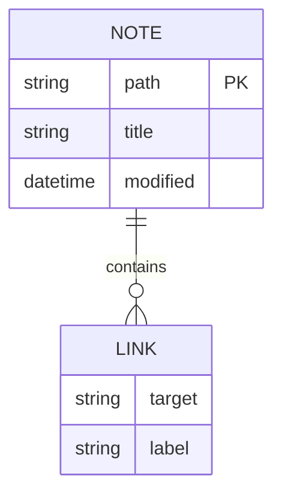

# Mixed editing boundaries

## Second-level heading
### Third-level heading
#### Fourth-level heading
##### Fifth-level heading
###### Sixth-level heading

Literal HTML: <script>window.__complexAttack = true</script>.

## Combined table

| Feature | Value | Detail |
| :--- | :---: | ---: |
| **Bold** and *italic* | `literal <br>` | 42 |
| Line breaks | First<br>Second | $75–$85 |
| Links | [Documentation](https://example.com) | café ✅ |

# Lists and tasks

- Top-level bullet
  - First nested bullet
    - Second nested bullet
- Another top-level bullet

1. First ordered item
2. Second ordered item
   1. Nested ordered item
   2. Another nested ordered item

3) Parenthesis ordered item
4) Another parenthesis item

- [ ] Incomplete task
- [x] Completed task
- [?] Question-state task
- [-] Canceled-state task
  - [ ] Nested incomplete task

Press Return at the end of an ordered item to continue its number. Press Return after a task to create another unchecked task. Press Return on an empty item to leave its list.

> [!warning]+ Review
> **Important** changes require review.
>
> - Nested bullet
> - [ ] Quoted task



```drawio
<mxfile><diagram name="Editing"><mxGraphModel><root><mxCell id="0"/><mxCell id="1" parent="0"/><mxCell id="2" value="Editor" vertex="1" parent="1" style="rounded=1;fillColor=#dae8fc;strokeColor=#6c8ebf;"><mxGeometry x="20" y="20" width="180" height="60" as="geometry"/></mxCell><mxCell id="3" value="Local vault" vertex="1" parent="1"><mxGeometry x="280" y="120" width="160" height="60" as="geometry"/></mxCell><mxCell id="4" value="Save" edge="1" source="2" target="3" parent="1"><mxGeometry relative="1" as="geometry"/></mxCell></root></mxGraphModel></diagram><diagram name="Reading"><mxGraphModel><root><mxCell id="0"/><mxCell id="1" parent="0"/><mxCell id="2" value="Preview" vertex="1" parent="1" style="rounded=1;fillColor=#dae8fc;strokeColor=#6c8ebf;"><mxGeometry x="20" y="20" width="180" height="60" as="geometry"/></mxCell><mxCell id="3" value="Local vault" vertex="1" parent="1"><mxGeometry x="280" y="120" width="160" height="60" as="geometry"/></mxCell><mxCell id="4" value="Save" edge="1" source="2" target="3" parent="1"><mxGeometry relative="1" as="geometry"/></mxCell></root></mxGraphModel></diagram></mxfile>
```

```typescript
const item0 = 0; // literal **markdown** $0
const item1 = 1; // literal **markdown** $1
const item2 = 2; // literal **markdown** $2
const item3 = 3; // literal **markdown** $3
const item4 = 4; // literal **markdown** $4
const item5 = 5; // literal **markdown** $5
const item6 = 6; // literal **markdown** $6
const item7 = 7; // literal **markdown** $7
const item8 = 8; // literal **markdown** $8
const item9 = 9; // literal **markdown** $9
const item10 = 10; // literal **markdown** $10
const item11 = 11; // literal **markdown** $11
```

# Advanced formatting

Plain paragraph with **bold**, *italic*, ***bold italic***, ~~strikethrough~~, and ==highlighted text==.

Nested formatting: **bold with _nested italic_ and `inline code`**.

Escaped syntax stays literal: \*not italic\*, \#not-a-tag, and 1\. not a list.

Inline `code with **literal markers**` and ``code containing a ` backtick``.

> A blockquote with **formatted text**.
>
> A second paragraph in the same quote.

---

Visible text before an %%inline editing comment%% visible text after it.

%%
This block comment is visible only while editing.
It can span multiple lines.
%%

#project/advanced #Unicode/✅

Paragraph with a block identifier. ^formatting-block

# Tables, math, and footnotes

| Left | Center | Right |
| :--- | :----: | ----: |
| **Bold** | `code` | $x^2$ |
| [[Targets/Linked Note\|Linked]] | escaped \| pipe | 42 |

Inline math: $e^{2i\pi} = 1$.

$$
\begin{vmatrix}
a & b\\
c & d
\end{vmatrix}=ad-bc
$$

A numbered footnote reference.[^1] A named footnote reference.[^named]

[^1]: A single-line footnote.

[^named]: A footnote with a readable identifier.
  Its continuation line is indented.

An inline footnote is reading-view-only in Obsidian.^[Inline footnote content.]

## End

Last editable paragraph.
