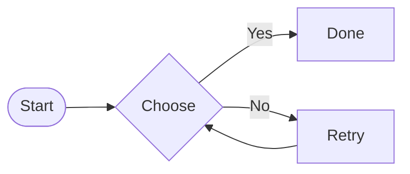
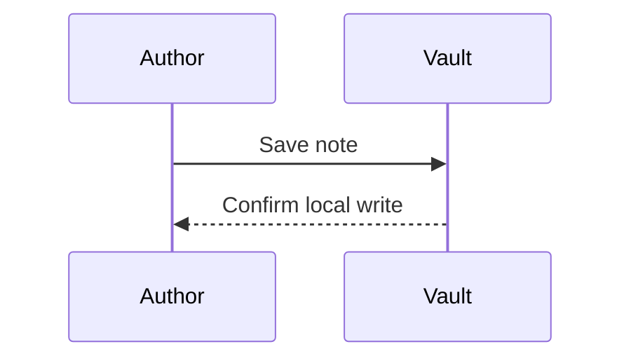
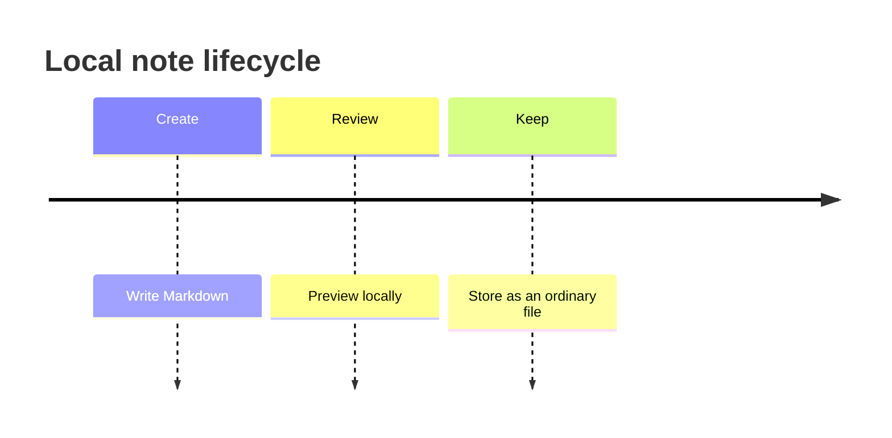

# Diagrams

```mermaid
flowchart LR
    Start([Start]) --> Choice{Choose}
    Choice -->|Yes| Done[Done]
    Choice -->|No| Retry[Retry]
    Retry --> Choice
```

```mermaid
sequenceDiagram
    participant A as Author
    participant V as Vault
    A->>V: Save note
    V-->>A: Confirm local write
```

```mermaid
timeline
    title Local note lifecycle
    Create : Write Markdown
    Review : Preview locally
    Keep : Store as an ordinary file
```
