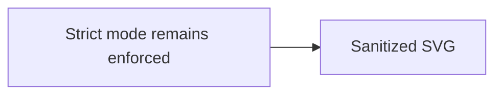

# Intentional security differences

The following constructs are comparison cases, not parity requirements. Local Markdown Vault deliberately keeps them inert or blocked.

<button onclick="alert('unsafe')">Raw HTML button</button>

[Blocked command](command:workbench.action.closeWindow)

[Blocked script](javascript:alert('unsafe'))

