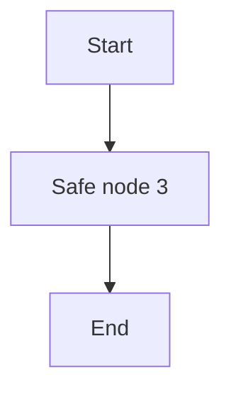

# Compatibility 093

Fixture path: `unicode-stress-and-security/093-compatibility-093.md`.

## Unicode, stress, and security

Résumé · naïve · coöperate · façade · jalapeño · smörgåsbord · 😀 · 👩🏽‍💻 · é · 𝄞

Very long token: `segment-segment-segment-segment-segment-segment-segment-segment-segment-segment-segment-segment-segment-segment-segment-segment-segment-segment-segment-segment-segment-segment-segment-segment-segment-segment-segment-segment-segment-segment-segment-segment-segment-segment-segment-segment-segment-segment-segment-segment-segment-segment-segment-segment-segment-segment-segment-segment-segment-segment-segment-segment-segment-segment-segment-segment-segment-segment-segment-segment-end`.

Raw HTML must stay inert: <button onclick="alert('blocked')">Do not run</button>.

Unsafe links must stay inert: [script](javascript:alert(1)) and [command](command:workbench.action.openSettings).

Encoded traversal image: 

Paragraph 1 for fixture 93 contains **bold**, *emphasis*, ~~deleted text~~, ==highlighted text==, and `inline code`.

Paragraph 2 for fixture 93 contains **bold**, *emphasis*, ~~deleted text~~, ==highlighted text==, and `inline code`.

Paragraph 3 for fixture 93 contains **bold**, *emphasis*, ~~deleted text~~, ==highlighted text==, and `inline code`.

Paragraph 4 for fixture 93 contains **bold**, *emphasis*, ~~deleted text~~, ==highlighted text==, and `inline code`.

Paragraph 5 for fixture 93 contains **bold**, *emphasis*, ~~deleted text~~, ==highlighted text==, and `inline code`.

Paragraph 6 for fixture 93 contains **bold**, *emphasis*, ~~deleted text~~, ==highlighted text==, and `inline code`.
