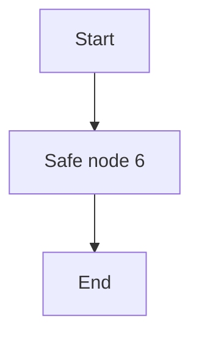

# Compatibility 096

Fixture path: `unicode-stress-and-security/096-compatibility-096.md`.

## Unicode, stress, and security

Résumé · naïve · coöperate · façade · jalapeño · smörgåsbord · 😀 · 👩🏽‍💻 · é · 𝄞

Very long token: `segment-segment-segment-segment-segment-segment-segment-segment-segment-segment-segment-segment-segment-segment-segment-segment-segment-segment-segment-segment-segment-segment-segment-segment-segment-segment-segment-segment-segment-segment-segment-segment-segment-segment-segment-segment-segment-segment-segment-segment-segment-segment-segment-segment-segment-segment-segment-segment-segment-segment-segment-segment-segment-segment-segment-segment-segment-segment-segment-segment-segment-segment-segment-segment-segment-segment-segment-segment-segment-segment-segment-segment-segment-segment-segment-segment-segment-segment-segment-segment-segment-segment-segment-segment-segment-segment-segment-segment-segment-segment-segment-segment-segment-segment-segment-segment-segment-segment-segment-segment-segment-segment-segment-segment-segment-segment-segment-segment-segment-segment-segment-segment-segment-segment-segment-segment-segment-segment-segment-segment-end`.

Raw HTML must stay inert: <button onclick="alert('blocked')">Do not run</button>.

Unsafe links must stay inert: [script](javascript:alert(1)) and [command](command:workbench.action.openSettings).

Encoded traversal image: 

Paragraph 1 for fixture 96 contains **bold**, *emphasis*, ~~deleted text~~, ==highlighted text==, and `inline code`.

Paragraph 2 for fixture 96 contains **bold**, *emphasis*, ~~deleted text~~, ==highlighted text==, and `inline code`.

Paragraph 3 for fixture 96 contains **bold**, *emphasis*, ~~deleted text~~, ==highlighted text==, and `inline code`.

Paragraph 4 for fixture 96 contains **bold**, *emphasis*, ~~deleted text~~, ==highlighted text==, and `inline code`.

Paragraph 5 for fixture 96 contains **bold**, *emphasis*, ~~deleted text~~, ==highlighted text==, and `inline code`.

Paragraph 6 for fixture 96 contains **bold**, *emphasis*, ~~deleted text~~, ==highlighted text==, and `inline code`.

Paragraph 7 for fixture 96 contains **bold**, *emphasis*, ~~deleted text~~, ==highlighted text==, and `inline code`.

Paragraph 8 for fixture 96 contains **bold**, *emphasis*, ~~deleted text~~, ==highlighted text==, and `inline code`.

Paragraph 9 for fixture 96 contains **bold**, *emphasis*, ~~deleted text~~, ==highlighted text==, and `inline code`.

Paragraph 10 for fixture 96 contains **bold**, *emphasis*, ~~deleted text~~, ==highlighted text==, and `inline code`.

Paragraph 11 for fixture 96 contains **bold**, *emphasis*, ~~deleted text~~, ==highlighted text==, and `inline code`.

Paragraph 12 for fixture 96 contains **bold**, *emphasis*, ~~deleted text~~, ==highlighted text==, and `inline code`.

Paragraph 13 for fixture 96 contains **bold**, *emphasis*, ~~deleted text~~, ==highlighted text==, and `inline code`.

Paragraph 14 for fixture 96 contains **bold**, *emphasis*, ~~deleted text~~, ==highlighted text==, and `inline code`.

Paragraph 15 for fixture 96 contains **bold**, *emphasis*, ~~deleted text~~, ==highlighted text==, and `inline code`.

Paragraph 16 for fixture 96 contains **bold**, *emphasis*, ~~deleted text~~, ==highlighted text==, and `inline code`.

Paragraph 17 for fixture 96 contains **bold**, *emphasis*, ~~deleted text~~, ==highlighted text==, and `inline code`.

Paragraph 18 for fixture 96 contains **bold**, *emphasis*, ~~deleted text~~, ==highlighted text==, and `inline code`.

Paragraph 19 for fixture 96 contains **bold**, *emphasis*, ~~deleted text~~, ==highlighted text==, and `inline code`.

Paragraph 20 for fixture 96 contains **bold**, *emphasis*, ~~deleted text~~, ==highlighted text==, and `inline code`.

Paragraph 21 for fixture 96 contains **bold**, *emphasis*, ~~deleted text~~, ==highlighted text==, and `inline code`.

Paragraph 22 for fixture 96 contains **bold**, *emphasis*, ~~deleted text~~, ==highlighted text==, and `inline code`.

Paragraph 23 for fixture 96 contains **bold**, *emphasis*, ~~deleted text~~, ==highlighted text==, and `inline code`.

Paragraph 24 for fixture 96 contains **bold**, *emphasis*, ~~deleted text~~, ==highlighted text==, and `inline code`.

Paragraph 25 for fixture 96 contains **bold**, *emphasis*, ~~deleted text~~, ==highlighted text==, and `inline code`.

Paragraph 26 for fixture 96 contains **bold**, *emphasis*, ~~deleted text~~, ==highlighted text==, and `inline code`.

Paragraph 27 for fixture 96 contains **bold**, *emphasis*, ~~deleted text~~, ==highlighted text==, and `inline code`.

Paragraph 28 for fixture 96 contains **bold**, *emphasis*, ~~deleted text~~, ==highlighted text==, and `inline code`.

Paragraph 29 for fixture 96 contains **bold**, *emphasis*, ~~deleted text~~, ==highlighted text==, and `inline code`.

Paragraph 30 for fixture 96 contains **bold**, *emphasis*, ~~deleted text~~, ==highlighted text==, and `inline code`.

Paragraph 31 for fixture 96 contains **bold**, *emphasis*, ~~deleted text~~, ==highlighted text==, and `inline code`.

Paragraph 32 for fixture 96 contains **bold**, *emphasis*, ~~deleted text~~, ==highlighted text==, and `inline code`.

Paragraph 33 for fixture 96 contains **bold**, *emphasis*, ~~deleted text~~, ==highlighted text==, and `inline code`.

Paragraph 34 for fixture 96 contains **bold**, *emphasis*, ~~deleted text~~, ==highlighted text==, and `inline code`.

Paragraph 35 for fixture 96 contains **bold**, *emphasis*, ~~deleted text~~, ==highlighted text==, and `inline code`.

Paragraph 36 for fixture 96 contains **bold**, *emphasis*, ~~deleted text~~, ==highlighted text==, and `inline code`.
