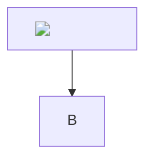

# Diagram boundary fixture



```drawio
<?xml version="1.0"?>
<!DOCTYPE mxfile [
  <!ENTITY file SYSTEM "file:///etc/passwd">
  <!ENTITY network SYSTEM "https://network.invalid/entity">
]>
<mxfile>
  <diagram>
    <mxGraphModel><root>
      <mxCell id="0"/>
      <mxCell id="1" parent="0"/>
      <mxCell id="2" value="&file;&network;&lt;img src=x onerror=alert(1)&gt;" vertex="1" parent="1">
        <mxGeometry width="120" height="40" as="geometry"/>
      </mxCell>
    </root></mxGraphModel>
  </diagram>
</mxfile>
```
